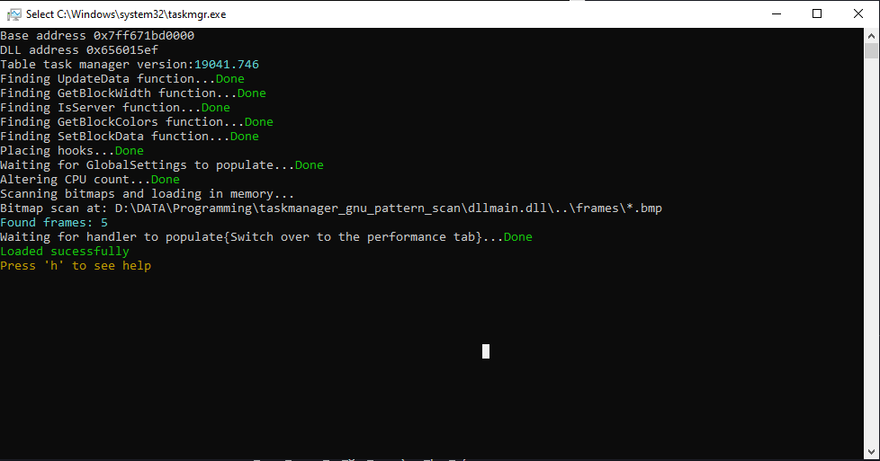

# Taskmanager
Enables you to alter the heatmap(by spoofing in the number of logical cores) in taskmanager to draw bitmaps.
No this will not magically give you more computing power. 
This will on work on the following task manager builds:
```
10.0.19041.844
10.0.19041.746
10.0.18362.1316
10.0.18362.1 - UNTESTED
```

## Compiling & Executing
Make sure you have [git](https://git-scm.com/downloads) and [mingw-w64](https://sourceforge.net/projects/mingw-w64/files/mingw-w64/)(x86_64,posix)  setup properly.
NOTE: This will only work with x64 mingw,install the x64 version of it.
#### Compiling
Execute the following commands in CMD or PowerShell or in MYSYS2:
```
git clone --recurse-submodules  https://github.com/turtiustrek/taskmanager
cd taskmanager
mingw32-make.exe 
```
This will compile the injector and the dll as injector.exe and dllmain.dll respectively. 
#### Executing 
Launch the ```Task Manager``` and then run the ```injector.exe``` as **admin**. 
This should inject the dll into the ```Task Manager``` and spawn a console in ```Task Manager```.
If all the checks passes then, switch over to the ```Preformance``` tab and set the update speed to ```High```  by navigating to ```View>Update Speed``` in task manager.
Switch over to ```Logical Processors``` in task manager by right clicking on the CPU graph and navigate to ```Change graph to > Logical Processors``` and it should display the bitmap.
If the bitmap seems distorted, adjust the ```BlockWidth``` by using the commmands in the console untill all of the blocks in task manager are on the screen and make sure that it does not scroll.

If you encounter a problem with any part, you can find me on discord or simply open a issue.
[](https://discord.com/invite/RrB6uJMqNw)


