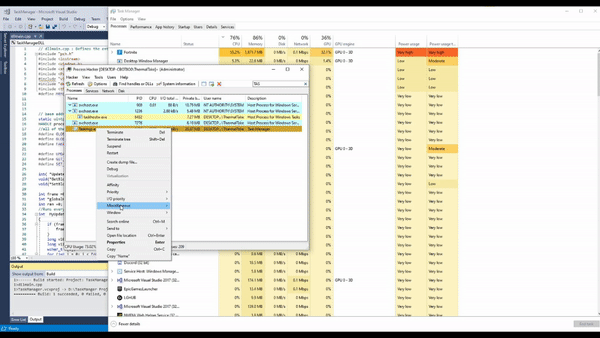

# Taskmanager
Enables you to alter the heatmap(by spoofing in the number of logical cores) in taskmanager to draw bitmaps.
No this will not magically give you more computing power. 
This only works on **Windows 10 build 1909**

## Compiling & Executing
Navigate through the ```Converter``` solution and compile the C# application.This will produce an array of pixels of the bitmaps placed in the ```Video/frame``` folder.
The output of the file will be placed in the ```TaskManager``` as ```video.h```.

The ```Taskmanager``` solution needs the microsoft detours library which can resolved from visual studio by opening the solution and navigating to ```Tools>NuGet Package Manager>Manage NuGet Packages For Solution``` and following the prompts .

The produced DLL can be injected from a tool like [Process Hacker](https://processhacker.sourceforge.io/)(as seen in the GIF above) or any other DLL Injector. 
